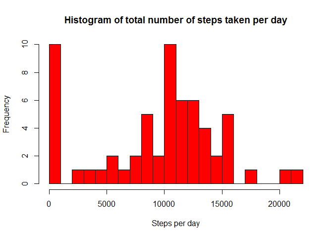
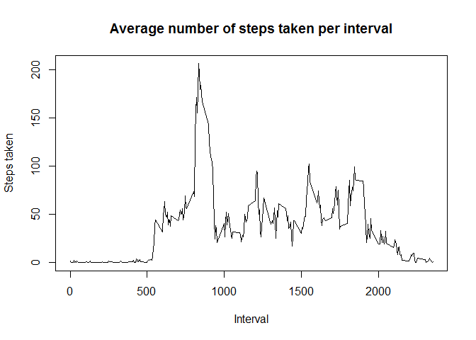
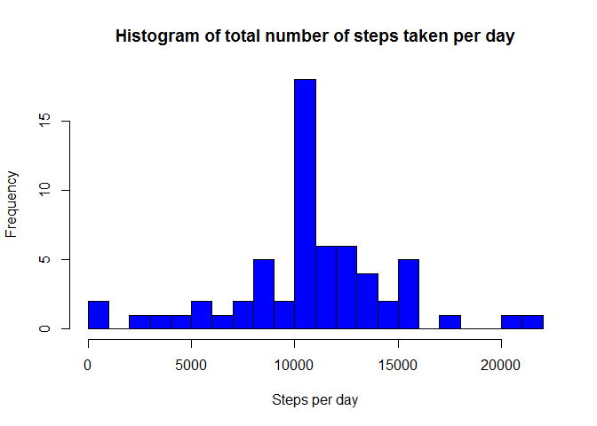
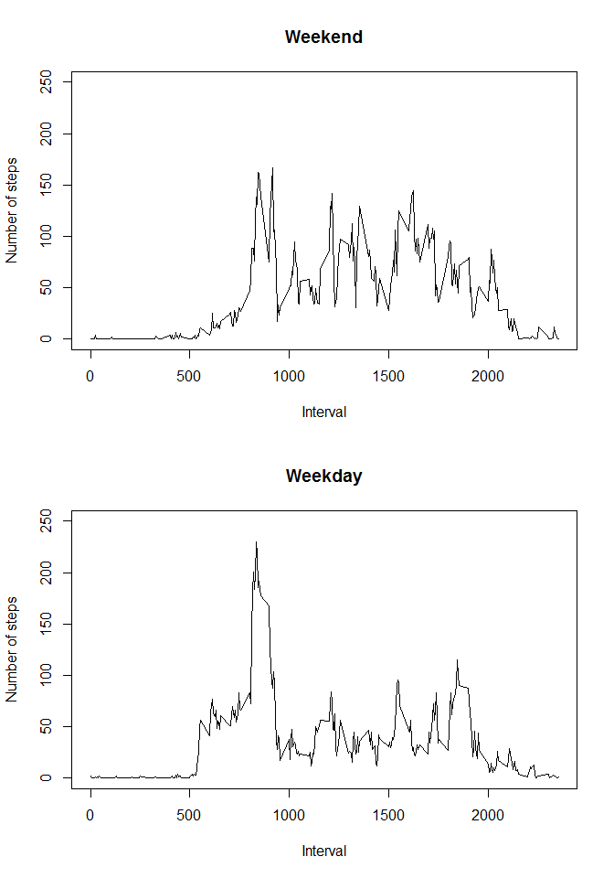

# Reproducible Research: Peer Assessment 1


## Loading and preprocessing the data

The data for this assignment can be downloaded from the course web site:

* Dataset: [Activity monitoring data](https://d396qusza40orc.cloudfront.net/repdata%2Fdata%2Factivity.zip) [52K]

The variables included in this dataset are:


* **steps**: Number of steps taking in a 5-minute interval (missing values are coded as `NA`)

* **date**: The date on which the measurement was taken in YYYY-MM-DD format

* **interval**: Identifier for the 5-minute interval in which measurement was taken

The dataset is stored in a comma-separated-value (CSV) file and there are a total of 17,568 observations in this dataset.

**Load the data (i.e. `read.csv()`)**


```r
filename <- "./activity.csv"
zipfile  <- "./activity.zip"
fileurl  <- "https://d396qusza40orc.cloudfront.net/repdata%2Fdata%2Factivity.zip"

if(!file.exists(filename)) {
        if(!file.exists(zipfile)) {
                download.file(
                        url = fileurl,
                        destfile = zipfile, mode="wb")
        }
        unzip(zipfile)
}

data <- read.csv(filename)
```


## What is mean total number of steps taken per day?


```r
library(dplyr)
```

**Calculate the total number of steps taken per day**


```r
dates <- group_by(data, date)
steps_per_date <- summarize(dates, total_steps = sum(steps, na.rm = TRUE))
```

**Make a histogram of the total number of steps taken each day**


```r
hist(steps_per_date$total_steps,
     breaks = 20,
     freq = TRUE,
     main = "Histogram of total number of steps taken per day",
     xlab = "Steps per day",
     col = "red")
```

 

**Calculate and report the mean and median of the total number of steps taken per day**


```r
mean_steps_per_day   <- mean(steps_per_date$total_steps, na.rm = TRUE)
median_steps_per_day <- median(steps_per_date$total_steps, na.rm = TRUE)
```

Mean of the total number of steps taken per day is 9354.2295082, and median is 10395.

## What is the average daily activity pattern?

**Make a time series plot (i.e. `type = "l"`) of the 5-minute interval (x-axis) and the average number of steps taken, averaged across all days (y-axis)**


```r
intervals <- group_by(data, interval)
steps_per_interval <- summarize(intervals, avg_steps = mean(steps, na.rm = TRUE))

plot(as.ts(steps_per_interval$interval), steps_per_interval$avg_steps, type = "l",
     main = "Average number of steps taken per interval",
     xlab = "Interval", ylab = "Steps taken")
```

 

**Which 5-minute interval, on average across all the days in the dataset, contains the maximum number of steps?**


```r
interval_max <- steps_per_interval$interval[which.max(steps_per_interval$avg_steps)]
```

5-minute interval which, on average across all the days in the dataset, contains the maximum number of steps is interval 835.

## Imputing missing values

**Calculate and report the total number of missing values in the dataset (i.e. the total number of rows with `NA`s)**


```r
rows_with_NAs <- sum(!complete.cases(data))
```

There are 2304 rows with missing values.

**Devise a strategy for filling in all of the missing values in the dataset. The strategy does not need to be sophisticated. For example, you could use the mean/median for that day, or the mean for that 5-minute interval, etc.**

I decided to use the mean for that 5-minute interval.

**Create a new dataset that is equal to the original dataset but with the missing data filled in.**


```r
data_new <- merge(x = data, y = steps_per_interval, by = "interval")
data_new$steps <- ifelse(is.na(data_new$steps), data_new$avg_steps, data_new$steps)

data_new <- subset(data_new, select = interval:date)
data_new <- arrange(data_new, date, interval)
```

**Make a histogram of the total number of steps taken each day and Calculate and report the mean and median total number of steps taken per day. Do these values differ from the estimates from the first part of the assignment? What is the impact of imputing missing data on the estimates of the total daily number of steps?**


```r
dates_new <- group_by(data_new, date)
steps_per_date_new <- summarize(dates_new, total_steps = sum(steps, na.rm = TRUE))

hist(steps_per_date_new$total_steps,
     breaks = 20,
     freq = TRUE,
     main = "Histogram of total number of steps taken per day",
     xlab = "Steps per day",
     col = "blue")
```

 

```r
mean_steps_per_day_new   <- mean(steps_per_date_new$total_steps, na.rm = TRUE)
median_steps_per_day_new <- median(steps_per_date_new$total_steps, na.rm = TRUE)
```

After filling in all of the missing values in the dataset, mean of the total number of steps taken per day is 1.0766189\times 10^{4}, and median is 1.0766189\times 10^{4}.

Old values were 9354.2295082 and 10395.


## Are there differences in activity patterns between weekdays and weekends?

**Create a new factor variable in the dataset with two levels – “weekday” and “weekend” indicating whether a given date is a weekday or weekend day.**


```r
Sys.setlocale("LC_TIME", "us")
```


```r
data_new$weekpart <- factor(ifelse(weekdays(as.Date(data_new$date)) %in% c("Saturday", "Sunday"),
                                   "weekend", "weekday"))
```


**Make a panel plot containing a time series plot (i.e. ``type = "l"``) of the 5-minute interval (x-axis) and the average number of steps taken, averaged across all weekday days or weekend days (y-axis).**


```r
par(mfrow = c(2,1))

# Weekend
data_weekend <- data_new[data_new$weekpart == "weekend",]

intervals_weekend <- group_by(data_weekend, interval)
steps_per_interval_weekend <- summarize(intervals_weekend, avg_steps = mean(steps, na.rm = TRUE))

plot(as.ts(steps_per_interval_weekend$interval), steps_per_interval_weekend$avg_steps, type = "l",
     main = "Weekend",
     xlab = "Interval", ylab = "Number of steps", ylim=c(0,250))

# Weekday
data_weekday <- data_new[data_new$weekpart == "weekday",]

intervals_weekday <- group_by(data_weekday, interval)
steps_per_interval_weekday <- summarize(intervals_weekday, avg_steps = mean(steps, na.rm = TRUE))

plot(as.ts(steps_per_interval_weekday$interval), steps_per_interval_weekday$avg_steps, type = "l",
     main = "Weekday",
     xlab = "Interval", ylab = "Number of steps", ylim=c(0,250))
```

 

